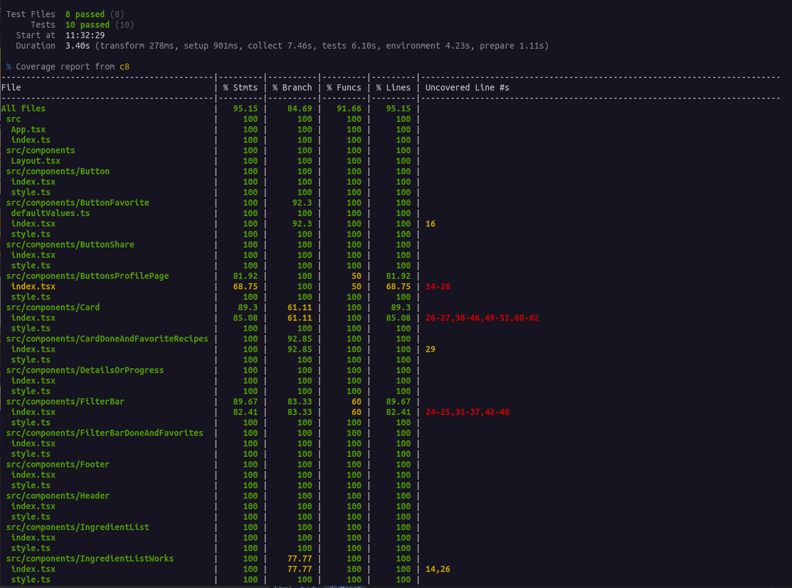
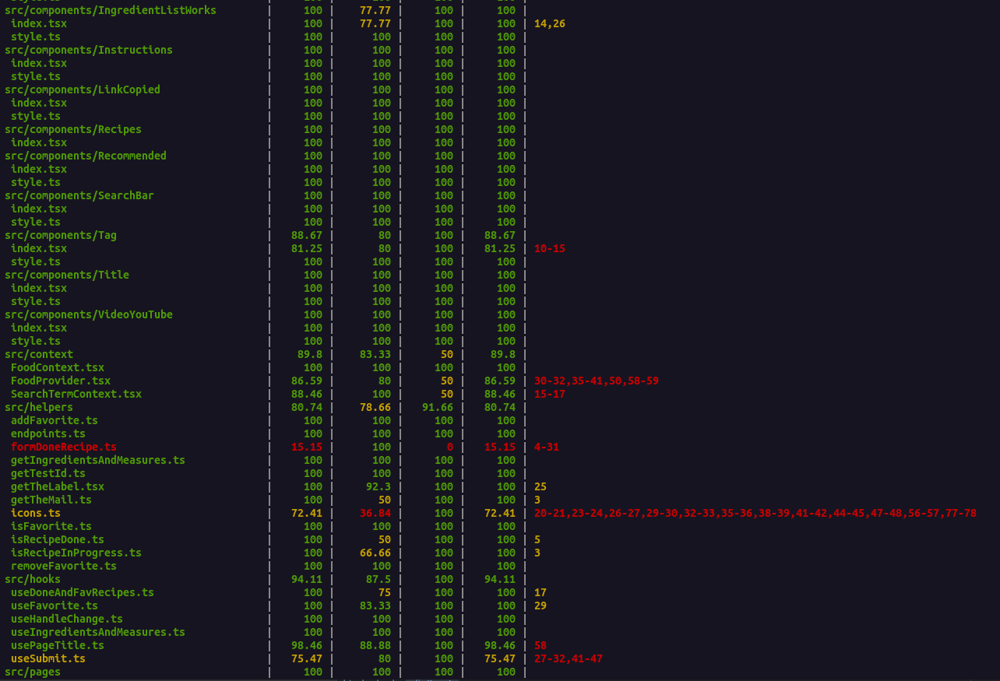
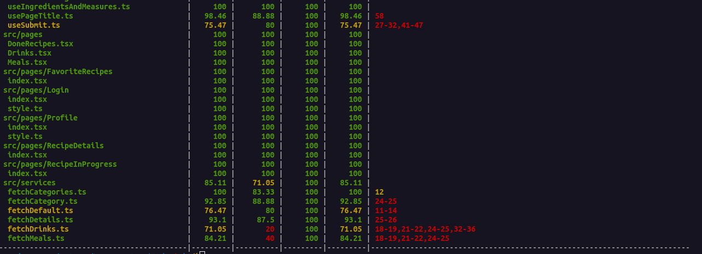

# <p align="center">Projeto App de Receitas</p>

## Contexto

Esse é projeto foi originalmente realizado em [grupo](https://github.com/mairess/project-recipes-app-ts), mas eu gostei tanto dele que fiz uma versão solo. Essa é uma aplicação versátil, que permite aos usuários explorar, buscar, filtrar, favoritar, compartilhar e acompanhar o processo de preparação de receitas e drinks. Utilizei duas APIs distintas, uma para comidas e outra para bebidas, garantindo uma ampla variedade de opções para os usuários. Usei `context api` para compartilhamento do estado da aplicação, `custom hooks`, `react router` e para testes usei `react testing library`, `vitest`, a estilização foi realizada com `styled-components` por meio de protótipo disponibilizado pela [Trybe](https://betrybe.com).

```JSON
O layout foi projetado com foco em dispositivos móveis apenas (360px de largura por 640px de altura).
```

<details>

<summary>O app</summary><br>


</details>

<details>

<summary><strong>Rode o projeto localmente</strong></summary><br>

> ⚠️ É preciso ter o [Node](https://nodejs.org/en) instalado em sua máquina.

Primeiro, clone o repositório:

```JSON
git clone git@github.com:mairess/project-recipes-app-ts.git
```

Instale as dependências:

```JSON
npm install
```

Inicie o vite server:

```JSON
npm run dev
```

### Os testes

Rode os testes com:

```JSON
npm test
```

Rode um teste específico:

```JSON
npm test RecipeDetails
```

Rode a cobertura dos testes:

```JSON
npm run coverage
```

<details>

<summary>Cobertura de testes</summary><br>







</details>

</details>

<details>

<summary><strong>Rode o projeto com o docker</strong></summary><br>

> ⚠️ É preciso ter o [Docker](https://www.docker.com/get-started/) instalado em sua máquina.

Primeiro, clone o repositório:

```JSON
git clone git@github.com:mairess/project-recipes-app-ts.git
```

Suba o container:

```JSON
docker compose up -d
```

O vite server estará disponível na porta `3000`:

```HTML
http://localhost:3000
```

</details>

## Competências desenvolvidas

- Capacidade de utilizar `Context API` do React para gerenciar estado.
- Capacidade de utilizar `Hooks customizados`.
- Capacidade de utilizar `Hook useContext`.
- Capacidade de utilizar `Hook useEffect`.
- Capacidade de escrever `testes`.
- Capacidade de garantir uma boa `cobertura de testes`.
- Capacidade de `gestão do tempo`.
